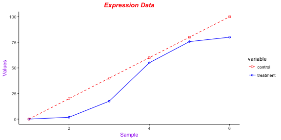

Plotting in R
========================================================
author: MRC London Institute of Medical Sciences (LMS)
date: https://lmsbioinformatics.github.io/LMS_PlottingInR/
width: 1440
height: 1100
autosize: true
font-import: <link href='http://fonts.googleapis.com/css?family=Slabo+27px' rel='stylesheet' type='text/css'>
font-family: 'Slabo 27px', serif;
css:style.css

Materials.
========================================================
id: materials

All prerequisites, links to material and slides for this course can be found on github.
* [PlottingInR](https://lmsbioinformatics.github.io/LMS_PlottingInR/)

Or can be downloaded as a zip archive from here. 
* [Download zip](https://github.com/LMSBioinformatics/LMS_PlottingInR/archive/master.zip)

Materials. - Presentations, source code and practicals.
========================================================

Once the zip file in unarchived. All presentations as HTML slides and pages, their R code and HTML practical sheets will be available in the directories underneath.

* **presentations/slides/**
Presentations as an HTML slide show.
* **presentations/singlepage/** 
Presentations as an HTML single page.
* **presentations/rcode/**
R code in presentations.
* **exercises/**
Practicals as HTML pages. 
* **answers/**
Practicals with answers as HTML pages and R code solutions. 

Set the Working directory
========================================================

Before running any of the code in the practicals or slides we need to set the working directory to the folder we unarchived. 

You may navigate to the unarchived LMS_PlottingInR/course folder in the Rstudio menu

**Session -> Set Working Directory -> Choose Directory**

<div align="center">

</div>


Set working directory - in the console
========================================================

Use getwd() to see where your current directory is


```r
getwd()
```

Use setwd() to see where your current directory is


```r
setwd("/PathToMyDownload/LMS_PlottingInR/course")
# e.g. setwd("~/Downloads/LMS_PlottingInR/course")
```

Plotting in R
========================================================
type:section
id:plotting

Introduction
========================================================

R has excellent graphics and plotting capabilities. They are mostly found in following three sources.
 + base graphics
 
    easy to use, conceptually motivated by drawing on a canvas
    
    would become difficult or impossible to draw complicated plots
    
 + the lattice package
 + the ggplot2 package
 
    high-level approach: grammar of graphics

 + saving your plots

 
Lattice and ggplot2 packages are built on grid graphics package while the base graphics routines adopt a pen and paper model for plotting.

We will start from the base graphics then focus on ggplot2


R Base Graphics
========================================================
type:section
id: baseGraph

Base Graphics
========================================================
+ Line Charts

First we'll produce a very simple graph using the values in the data.frame that we created:


```r
base_graph_df<- data.frame(sample_num=c(1:6),days=c("Mon","Tue","Wed","Thu","Fri","Sat"),
                           treatment=c(0.02,1.8, 17.5, 55,75.7, 80),
                           control= c(0, 20, 40, 60, 80,100))

base_graph_df
```

```
  sample_num days treatment control
1          1  Mon      0.02       0
2          2  Tue      1.80      20
3          3  Wed     17.50      40
4          4  Thu     55.00      60
5          5  Fri     75.70      80
6          6  Sat     80.00     100
```

Base Graphics
========================================================
+ Line Charts

Plot the treatment with default parameters


```r
?plot
```

    * Usage

    plot(x, y, ...)


```r
plot(base_graph_df$sample_num, base_graph_df$treatment)
```

Line Plot
========================================================


=======================================================
Now, let's add a **title**, a **line to connect the points**, and some **colour**:

Plot treatment using blue points overlayed by a line

hint: look into the "type" argument


```r
?plot
```

## Arguments

  * type
  
        what type of plot should be drawn. Possible types are
        
        "p" for points,
        
        "l" for lines,
        
        "b" for both,
        
        "c" for the lines part alone of "b",
        
        "o" for both ‘overplotted’,
        
        "h" for ‘histogram’ like (or ‘high-density’) vertical lines,
        
        "s" for stair steps,
        
        "S" for other steps, see ‘Details’ below,
        
        "n" for no plotting.

=======================================================


```r
plot(base_graph_df$sample_num,base_graph_df$treatment, type="o", col="blue")
```

Create a title with a red, bold/italic font

hint: 1=plain, 2=bold, 3=italic, 4=bold italic, 5=symbol

```r
title(main="Treatment", col.main="red", font.main=4)
```

Line Plot
========================================================


========================================================
Now let's add a **red line for variable control** from the data.frame **base_graph_df** and **specify the y-axis range** directly so it will be large enough to fit the data:

* show the control information

```r
base_graph_df$control
```

```
[1]   0  20  40  60  80 100
```

* Plot **treatment** using a y axis that ranges from 0 to 100

```r
plot(base_graph_df$sample_num,base_graph_df$treatment, type="o", col="blue", ylim=c(0,100))
```
* Plot **control** with **red dashed line** and **square points**

```r
lines(base_graph_df$control, type="o", pch=22, lty=2, col="red")
```


==========================================================

Create a title with a red, bold/italic font

```r
title(main="Expression Data", col.main="red", font.main=4)
```


==========================================================

Next let's change the axes labels to match our data and add a legend. 

We'll also compute the y-axis values using the max function so any changes to our data will be automatically reflected in our graph. 

* Calculate range from 0 to max value of data

```r
g_range <- range(0, base_graph_df$treatment, base_graph_df$control)
g_range
```

```
[1]   0 100
```

range returns a vector containing the minimum and maximum of all the given arguments.

* Plot treatment using y axis that ranges from 0 to max value in treatment or control vector.  Turn off axes and annotations (axis labels) so we can specify them ourselves.


```r
plot(base_graph_df$sample_num ,base_graph_df$treatment, type="o", col="blue", ylim=g_range,
     axes=FALSE, ann=FALSE)
```

========================================================

Make x axis using labels

```r
axis(1, at=1:6, lab=base_graph_df$days)
```

Make y axis with horizontal labels that display ticks at every 20 marks. 


```r
axis(2, las=1, at=20*0:g_range[2])
```

Create box around plot

```r
box()
```

========================================================

Plot control vector with red dashed line and square points


```r
lines(base_graph_df$control, type="o", pch=22, lty=2, col="red")
```

Create a title with a red, bold/italic font

```r
title(main="Data", col.main="red", font.main=4)
```

Label the x and y axes with dark green text

```r
title(xlab="Samples", col.lab=rgb(0,0.5,0))
title(ylab="Values", col.lab=rgb(0,0.5,0))
```

========================================================

Create a legend at (1, g_range[2]) that is slightly smaller (cex) and uses the same line colors and points used by the actual plots 


```r
legend(1, g_range[2], c("treatment","control"), cex=0.8, col=c("blue","red"), pch=21:22, lty=1:2);  
```


 	
Bar Charts	
========================================================	
	

Let's start with a simple bar chart graphing the base_graph_df$treatment: 
Plot treatment


```r
barplot(base_graph_df$treatment)
```


========================================================
 
Let's add labels, blue borders around the bars, and density lines: 

Plot treatment with specified labels for axes.  Use blue borders and diagonal lines in bars.


```r
barplot(base_graph_df$treatment, main="Treatment", xlab="Days",ylab="values", 
        names.arg=base_graph_df$days,  
        border="blue", density=c(10,20,30,40,50,60))
```


========================================================

names.arg  is a vector of names to be plotted below each bar or group of bars. 
density	a vector giving the density of shading lines, in lines per inch, for the bars or bar components.


========================================================	
Now let's plot the treatment data using some color and show a legend: 

   
Graph data with adjacent bars using colors


```r
barplot(as.matrix(base_graph_df[,c("treatment","control")]), main="Data", ylab= "Total", 
        beside=TRUE, col= c("lightblue", "mistyrose", "lightcyan","lavender", "cornsilk","maroon"))
```

Place the legend at the top-left corner with no frame


```r
legend("topleft", c("Mon","Tue","Wed","Thu","Fri","Sat"), cex=0.8,bty="n", 
fill=  c("lightblue", "mistyrose", "lightcyan","lavender", "cornsilk","maroon"));
```

========================================================


Histograms
========================================================	

Let's start with a simple histogram plotting the distribution of the treatment vector: 

Create a histogram for treatment

```r
hist(base_graph_df$treatment)	
```


========================================================

Concatenate the three vectors


```r
all <- c(base_graph_df$control, base_graph_df$treatment)
```

Create a histogram for data in light blue with the y axis ranging from 0-10

```r
hist(all, col="lightblue", ylim=c(0,10))
```


======================================================== 	

Now change the breaks so none of the values are grouped together and flip the y-axis labels horizontally. 

Compute the largest value used in the data


```r
max_num <- max(all)
```

Create a histogram for data with fire colors, set breaks so each number   is in its own group, make x axis range from 0-max_num, disable right-closing  of cell intervals, set heading, and make  y-axis labels horizontal.

========================================================


```r
hist(all, col=heat.colors(max_num), breaks=max_num, xlim=c(0,max_num), right=F, 
main="Histogram", las=1)	
```

breaks: a single number giving the number of cells for the histogram,
An open interval does not include its endpoints, and is indicated with parentheses.

For example (0,1) means greater than 0 and less than 1. 

A closed interval includes its endpoints, and is denoted with square brackets. 
For example [0,1] means greater than or equal to 0 and less than or equal to 1.


========================================================


========================================================

Now let's create uneven breaks and graph the probability density. 

 Create uneven breaks

```r
brk <- c(0,30,40,50,60,80,100)
```

Create a histogram for all data with fire colours, set uneven breaks, make x axis range from 0-max_num, disable right-closing of cell intervals, set heading, make y-axis labels horizontal, make axis labels smaller, make areas of each column proportional to the count

========================================================


```r
hist(all, col=heat.colors(length(brk)), breaks=brk,xlim=c(0,max_num), right=F, main="Probability Density",las=1, cex.axis=0.8, freq=F)
```

 		
freq	logical; 
if TRUE, the histogram graphic is a representation of frequencies

if FALSE, probability densities, component density, are plotted


Combining Plots
======================================================== 


R makes it easy to combine multiple plots into one overall graph, using either the par( ) or layout( ) function. 
With the par( ) function, you can include the option mfrow=c(nrows, ncols) to create a matrix of nrows x ncols plots that are filled in by row.
mfcol=c(nrows, ncols) fills in the matrix by columns.

Define a layout with 2 rows and 2 columns


```r
par(mfrow=c(2,2))
```


========================================================

Here, we will use different dataset with two columns each for treated and untreated samples.


```r
data1 <- read.table("data/gene_data.txt", header=T, sep="\t")
head(data1)
```

```
     ensembl_gene_id Untreated1 Untreated2  Treated1   Treated2
1 ENSDARG00000093639  0.8616832  1.9311442 0.1041508 0.14055604
2 ENSDARG00000094508  0.9857575  2.0256352 0.1549917 0.20301609
3 ENSDARG00000095893  0.8498889  1.9875580 0.2317969 0.20925123
4 ENSDARG00000095252  0.9242996  2.0857620 0.2562264 0.24669079
5 ENSDARG00000078878  0.3571734  0.4653908 0.1167221 0.09710237
6 ENSDARG00000079403  1.0604071  1.2581398 0.3884836 0.31567299
```

========================================================

Plot histograms for different columns in the data frame separately. This is not very efficient. 
You could also do it more efficiently using for loop.


```r
hist(data1$Untreated1)
hist(data1$Treated2)
hist(data1$Untreated2)
boxplot(data1$Treated1)
```

========================================================

 


========================================================

Recover the original settings


```r
par(mfrow=c(1,1))
```


ggplot2 R package
========================================================
type:section
id:ggplot2

ggplot2 is a powerful R package based on the grammar of graphics (Wilkinson, 2005). 

"In brief, the grammar tells us that a statistical graphic is a mapping from data to aesthetic attributes (colour, shape, size) of geometric objects (points, lines, bars)." - Wickham, 2016

ggplot2 R package
========================================================

We'll use the **GoT_dataset** that kindly provided by Dr. Reidar P. Lystad. Inj Epidemiol. 2018. 5(1):44. doi: 10.1186/s40621-018-0174-7. (https://figshare.com/articles/Game_of_Thrones_mortality_and_survival_dataset/8259680)

We can use the head function to look at the first few rows of file "episode_data.csv"

```r
library(ggplot2)
episode_data<-read.csv("GoT_dataset/episode_data.csv")

head(episode_data)
```

```
  season episode_number                            episode_name
1      1              1                      "Winter Is Coming"
2      1              2                         "The Kingsroad"
3      1              3                             "Lord Snow"
4      1              4 "Cripples, Bastards, and Broken Things"
5      1              5                 "The Wolf and the Lion"
6      1              6                        "A Golden Crown"
  gross_running_time opening_credits_time closing_credits_time
1               3546                  110                   33
2               3182                  111                   34
3               3294                   96                   27
4               3201                   96                   26
5               3123                  101                   24
6               3027                  103                   26
  net_running_time cumulative_net_running_time
1             3403                        3403
2             3037                        6440
3             3171                        9611
4             3079                       12690
5             2998                       15688
6             2898                       18586
```


========================================================

## Every ggplot2 plot has three key components:

    1. data,
    
    2. aesthetic mappings between variables in the data and visual
    properties, and
    
    3. layer: usually created with a geom function.


========================================================

use ggplot2's ggplot() function to setup **data** and **aesthetic mappings**


```r
g<-ggplot(data=episode_data, aes(x=gross_running_time,y=net_running_time))

print(g)
```


add geom_point layer - Scatter plot
========================================================


```r
g<-ggplot(data=episode_data, aes(x=gross_running_time,y=net_running_time))
g + geom_point()
```


add geom_histogram layer - Histogram plot (1/2)
========================================================


```r
ghis<-ggplot(data=episode_data, aes(x=net_running_time))
ghis + geom_histogram()
```


add geom_histogram layer - Histogram plot (2/2)
========================================================
change binwidth


```r
#ghis<-ggplot(data=episode_data, aes(x=net_running_time))
ghis + geom_histogram(binwidth=200)
```




add geom_density layer - Density plot
========================================================
add geom_density layer


```r
#ghis<-ggplot(data=episode_data, aes(x=net_running_time))
ghis + geom_density()
```


Box plot (1/) - use geom_boxplot
========================================================
add geom_boxplot layer


```r
episode_data$season<-as.factor(episode_data$season)

gbox<-ggplot(data=episode_data, aes(x=season,y=net_running_time))
gbox + geom_boxplot()
```


Box plot (2/) - add more layers
========================================================
add geom_point layer


```r
episode_data$season<-as.factor(episode_data$season)

gbox<- ggplot(data=episode_data, aes(x=season,y=net_running_time))
gbox + geom_boxplot() + geom_point()
```


Saving your plots
========================================================


There are many different ways of saving your plots in R. 

The only argument you would need is name of file in which you want to save the plot.

Plotting commands then can be entered as usual.
The output would be redirected to the file. 

When you're done with your plotting commands, enter the dev.off() command. 


```r
bmp(filename, width = 480, height = 480, units = "px", point-size = 12)
jpeg(filename, width = 480, height = 480, units = "px", point-size = 12, quality = 75)
```

========================================================

Saving in bitmap format

```r
bmp(file = "control.bmp")
plot(control)
dev.off()
```

Saving in jpeg format

```r
jpeg(file = "control.jpg", quality = 20)
plot(control)
dev.off()
```

========================================================

Saving in postscript format


```r
postscript(file = "control.ps")
plot(control)
dev.off()
```
saving in pdf format


```r
pdf(file = "control.pdf", paper = "A4")
plot(control)
dev.off()
```

Summary
========================================================
- Visualization of data through charts and graphs is an essential 
part of data analysis process, so R has excellent tools for creating 
graphics.
- There are many different ways of making plots in R
including base graphics and R packages such as lattics and ggplot2.
- Use vast arrays of R packages available to create 
publication quality graphs.

========================================================
Time for an exercise!
========================================================
Exercise on Plotting can be found [here](http://mrccsc.github.io/Reproducible-R/r_course/exercises/Plotting_exercise.html)
Answers to exercise.
========================================================
Answers can be found here [here](answers/Plotting_answers.html)


